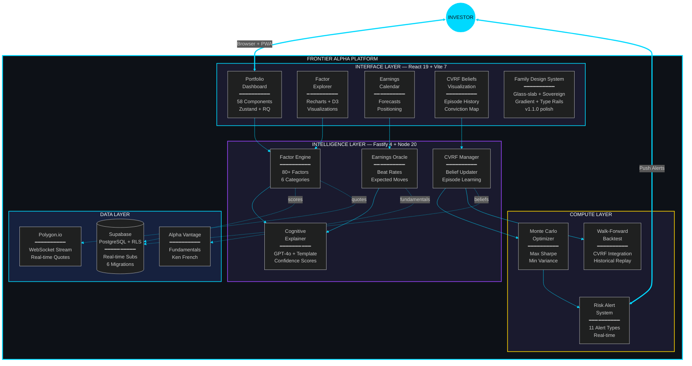
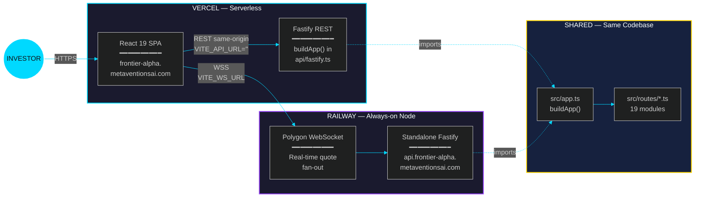

<div align="center">


<br/>

[](https://metaventionsai.com)
[](https://github.com/Dicoangelo)
[](https://frontier-alpha.metaventionsai.com)
[](LICENSE)

<br/>


<br/><br/>


<br/>

*AI-powered portfolio optimization with explainable recommendations and self-improving belief systems.*

</div>


<br/>

## Core Philosophy

<div align="center">

```
┌────────────────────────────────────────────────────────────────────────────────┐
│                                                                                │
│   ANALYZE           →          LEARN            →          EXPLAIN            │
│   76 quantitative               from every                  every decision    │
│   factors                       episode                     in plain language  │
│                                                                                │
│   ══════════════════════════════════════════════════════════════════════════   │
│                                                                                │
│   • Institutional-grade quant          • Self-improving CVRF beliefs          │
│   • Beyond Fama-French 5              • Walk-forward backtesting             │
│   • Real-time streaming               • LLM + template explanations          │
│                                                                                │
└────────────────────────────────────────────────────────────────────────────────┘
```

</div>

<br/>


<br/>

## System Architecture

<div align="center">


```mermaid
%%{init: {'theme': 'dark', 'themeVariables': { 'primaryColor': '#00d9ff', 'primaryTextColor': '#fff', 'primaryBorderColor': '#00d9ff', 'lineColor': '#00d9ff', 'secondaryColor': '#1a1a2e', 'tertiaryColor': '#0d1117', 'clusterBkg': '#0d1117', 'clusterBorder': '#00d9ff'}}}%%
flowchart TB
    subgraph PLATFORM["FRONTIER ALPHA PLATFORM"]
        direction TB

        subgraph CLIENT["INTERFACE LAYER — React 19 + Vite 7"]
            direction LR
            PORTFOLIO["Portfolio\nDashboard\n━━━━━━━━━━\n58 Components\nZustand + RQ"]
            FACTORS["Factor\nExplorer\n━━━━━━━━━━\nRecharts + D3\nVisualizations"]
            EARNINGS["Earnings\nCalendar\n━━━━━━━━━━\nForecasts\nPositioning"]
            CVRF_UI["CVRF Beliefs\nVisualization\n━━━━━━━━━━\nEpisode History\nConviction Map"]
            DS_FAMILY["Family Design System\n━━━━━━━━━━\nGlass-slab + Sovereign\nGradient + Type Rails\nv1.1.0 polish"]
        end

        subgraph SERVER["INTELLIGENCE LAYER — Fastify 4 + Node 20"]
            direction LR
            FACTOR_ENGINE["Factor Engine\n━━━━━━━━━━\n80+ Factors\n6 Categories"]
            CVRF_CORE["CVRF Manager\n━━━━━━━━━━\nBelief Updater\nEpisode Learning"]
            ORACLE["Earnings Oracle\n━━━━━━━━━━\nBeat Rates\nExpected Moves"]
            EXPLAINER["Cognitive\nExplainer\n━━━━━━━━━━\nGPT-4o + Template\nConfidence Scores"]
        end

        subgraph ENGINES["COMPUTE LAYER"]
            direction LR
            OPTIMIZER["Monte Carlo\nOptimizer\n━━━━━━━━━━\nMax Sharpe\nMin Variance"]
            BACKTEST["Walk-Forward\nBacktest\n━━━━━━━━━━\nCVRF Integration\nHistorical Replay"]
            RISK["Risk Alert\nSystem\n━━━━━━━━━━\n11 Alert Types\nReal-time"]
        end

        subgraph DATA["DATA LAYER"]
            SUPABASE[("Supabase\nPostgreSQL + RLS\n━━━━━━━━━━\nReal-time Subs\n6 Migrations")]
            POLYGON["Polygon.io\n━━━━━━━━━━\nWebSocket Stream\nReal-time Quotes"]
            ALPHA["Alpha Vantage\n━━━━━━━━━━\nFundamentals\nKen French"]
        end
    end

    INVESTOR(("INVESTOR"))

    INVESTOR <==>|"Browser + PWA"| PORTFOLIO
    INVESTOR <==>|"Push Alerts"| RISK
    PORTFOLIO --> FACTOR_ENGINE
    FACTORS --> FACTOR_ENGINE
    EARNINGS --> ORACLE
    CVRF_UI --> CVRF_CORE
    FACTOR_ENGINE --> EXPLAINER
    CVRF_CORE --> OPTIMIZER
    CVRF_CORE --> BACKTEST
    ORACLE --> EXPLAINER
    OPTIMIZER --> RISK
    FACTOR_ENGINE -.->|"scores"| SUPABASE
    CVRF_CORE -.->|"beliefs"| SUPABASE
    FACTOR_ENGINE -.->|"quotes"| POLYGON
    ORACLE -.->|"fundamentals"| ALPHA

    style PLATFORM fill:#0d1117,stroke:#00d9ff,stroke-width:3px
    style CLIENT fill:#1a1a2e,stroke:#00d9ff,stroke-width:2px
    style SERVER fill:#1a1a2e,stroke:#9945ff,stroke-width:2px
    style ENGINES fill:#1a1a2e,stroke:#ffd700,stroke-width:2px
    style DATA fill:#16213e,stroke:#00d9ff,stroke-width:2px
    style INVESTOR fill:#00d9ff,stroke:#fff,stroke-width:2px,color:#0d1117
```

<sub>Layered architecture — Institutional-grade intelligence for retail investors</sub>

</div>

<br/>


<br/>

## Two-Tier Deployment

<div align="center">

*Two runtimes, one codebase — Vercel hosts the SPA + REST surface, Railway hosts the WebSocket gateway because serverless can't keep long-lived connections alive.*


```mermaid
%%{init: {'theme': 'dark', 'themeVariables': { 'primaryColor': '#00d9ff', 'primaryTextColor': '#fff', 'primaryBorderColor': '#00d9ff', 'lineColor': '#00d9ff', 'secondaryColor': '#1a1a2e', 'tertiaryColor': '#0d1117', 'clusterBkg': '#0d1117', 'clusterBorder': '#00d9ff'}}}%%
flowchart LR
    USER(("INVESTOR"))

    subgraph VERCEL["VERCEL — Serverless"]
        SPA["React 19 SPA<br/>━━━━━━━━━━<br/>frontier-alpha.<br/>metaventionsai.com"]
        REST["Fastify REST<br/>━━━━━━━━━━<br/>buildApp() in<br/>api/fastify.ts"]
    end

    subgraph RAILWAY["RAILWAY — Always-on Node"]
        FASTIFY["Standalone Fastify<br/>━━━━━━━━━━<br/>api.frontier-alpha.<br/>metaventionsai.com"]
        WS["Polygon WebSocket<br/>━━━━━━━━━━<br/>Real-time quote<br/>fan-out"]
    end

    subgraph SHARED["SHARED — Same Codebase"]
        SRC["src/app.ts<br/>buildApp()"]
        ROUTES["src/routes/*.ts<br/>19 modules"]
    end

    USER -->|"HTTPS"| SPA
    SPA -->|"REST same-origin<br/>VITE_API_URL=''"| REST
    SPA -->|"WSS<br/>VITE_WS_URL"| WS
    WS --> FASTIFY
    REST -.->|"imports"| SRC
    FASTIFY -.->|"imports"| SRC
    SRC --> ROUTES

    style VERCEL fill:#1a1a2e,stroke:#00d9ff,stroke-width:2px
    style RAILWAY fill:#1a1a2e,stroke:#9945ff,stroke-width:2px
    style SHARED fill:#16213e,stroke:#ffd700,stroke-width:2px
    style USER fill:#00d9ff,stroke:#fff,stroke-width:2px,color:#0d1117
```

</div>

### Production URLs

| Surface | URL | Runtime | Notes |
|:--------|:----|:-------:|:------|
| **SPA + REST API** | [`frontier-alpha.metaventionsai.com`](https://frontier-alpha.metaventionsai.com) | Vercel | Apex domain — serves the React SPA and same-origin Fastify REST via `api/fastify.ts` catch-all |
| **WebSocket + REST** | `frontier-alpha-api-production.up.railway.app` | Railway | Always-on Fastify with `@fastify/websocket` — hosts Polygon WS fan-out |
| **API subdomain** | `api.frontier-alpha.metaventionsai.com` | Railway | Custom domain, TLS provisioning in progress |

Client config:
- `VITE_API_URL=''` — same-origin REST (Vercel)
- `VITE_WS_URL=wss://frontier-alpha-api-production.up.railway.app/ws/quotes` — Railway WebSocket

<br/>

### Backend Integrations (9 of 11 live)

| Integration | Status | Provider |
|:------------|:------:|:---------|
| **Supabase auth + RLS** | ✅ Live | service-role JWT |
| **Polygon REST** | ✅ Live | Polygon.io |
| **Polygon WebSocket** | ✅ Live (Railway-hosted) | Polygon.io |
| **Alpha Vantage** | ✅ Live | Alpha Vantage |
| **LLM explainer** | ✅ Live | DeepSeek (preferred) / OpenAI fallback |
| **Stripe billing** | ✅ Live | Pro $29 + Enterprise $99 |
| **Paper trading** | ✅ Live | Internal SimulatedBroker (Supabase + Polygon WS) |
| **VAPID web push** | ✅ Live | self-generated keys |
| **Email** | ✅ Live | Resend |
| **ML sentiment** | ✅ Live | DeepSeek llm-classification |
| **Rate limiter** | ⚠️ in-memory fallback | Upstash deferred |

Diagnostic endpoint: `GET /api/v1/health/integrations`

<br/>


<br/>

## Modular Architecture

Every subsystem is a **module** — swap implementations with a config change, zero code changes.

```
75+ modules · 81+ API routes · 265 tests · 22 subsystems · 14 migrations · 9/11 integrations live · Two-tier deploy
```

| Subsystem | Module | Ships with | Extend |
|-----------|--------|------------|--------|
| **Factor Analysis** | `FactorEngine` | 76 factors across 6 categories (momentum, value, quality, volatility, size, sentiment), Fama-French + custom | Custom factor plugins via `factors/` |
| **CVRF Intelligence** | `CVRFManager` | Belief updater, concept extractor, episode manager, persistent storage, conviction tracking | Custom belief models via `cvrf/` |
| **Cognitive Explainer** | `ExplanationService` | DeepSeek (primary) + OpenAI (fallback) + template, confidence scores, source attribution | Any OpenAI-compatible LLM |
| **Portfolio Optimization** | `PortfolioOptimizer` | Monte Carlo simulation, max Sharpe, min variance, risk parity, CVRF-weighted | Custom objective functions |
| **Backtesting** | `WalkForwardEngine` | Walk-forward engine, CVRF integration, historical data loader, episode replay | Custom strategies via `backtest/` |
| **Earnings Oracle** | `EarningsOracle` | Calendar, consensus estimates, beat rates, expected moves, historical reactions | Custom data sources |
| **Risk System** | `RiskAlertSystem` | 11 alert types (drawdown, volatility, concentration, factor drift, stop loss, take profit + 5 more) | Custom alert types |
| **Market Data** | `MarketDataProvider` | Polygon.io (WebSocket streaming), Alpha Vantage (fundamentals), Ken French Library | Any data provider |
| **Trading** | `BrokerAdapter` | Internal SimulatedBroker (paper trading on Polygon WS + Supabase), order management, preview, market clock, position tracking | Any broker API |
| **Billing** | `StripeService` | Stripe checkout, customer portal, webhook, Pro $29 + Enterprise $99 tiers, idempotent product registration | Any payment provider |
| **Options** | `GreeksCalculator` | Implied volatility surface, Greeks calculation, strategy builder, chain analysis | Custom pricing models |
| **ML Engine** | `NeuralFactorModel` | Regime detection, factor attribution, neural models, training pipeline | Custom models via `ml/` |
| **Tax Optimization** | `TaxLotTracker` | Lot tracking, loss harvesting, wash sale detection, efficient rebalancer, reporting | Custom tax rules |
| **SEC Monitoring** | `SECFilingMonitor` | Edgar filings, real-time filing alerts, SEC document parsing | Custom filing types |
| **Sentiment** | `SentimentAnalyzer` | News sentiment scoring, social signal processing | Custom sentiment sources |
| **Notifications** | `PushService` | VAPID Web Push, SSE streaming, alert delivery, browser push | Custom channels |
| **Analytics** | `PerformanceAttribution` | Return attribution, factor decomposition, Brinson-style analysis | Custom attribution models |
| **Cache** | `RedisCache` | Redis-backed caching with LRU eviction | Any cache backend |
| **Auth** | `AuthMiddleware` | JWT + API key authentication, Supabase Row Level Security, rate limiting | Custom auth providers |
| **Social** | `SharingService` | Portfolio sharing, leaderboards, public profiles, social discovery | Custom social features |
| **Multi-Currency** | `MultiCurrency` | Currency conversion, international market support | Custom currency providers |
| **Observability** | `MetricsCollector` | Structured logging (Pino), performance metrics, error tracking | Prometheus, OTel (planned) |

### Platform Support

- ✅ **Vercel** — Serverless + static deployment (production)
- ✅ **Docker** — Full-stack containerized (`docker-compose.yml`)
- ✅ **Railway** — Auto-deploy from git (`railway.toml`)
- ✅ **Render** — Alternative PaaS deployment (`render.yaml`)
- ✅ **Local** — `npm run dev:all` (API port 3000, client port 5173)
- 🚧 **Python ML** — Optional uvicorn engine (port 8000)

### CVRF Engine (Full-Stack Belief System)

All custom, zero external ML dependencies — no scikit-learn, no TensorFlow, no framework lock-in:

| Layer | Implementation |
|-------|---------------|
| **Concept Extraction** | `ConceptExtractor.ts` — extract investment beliefs from factor analysis |
| **Belief Management** | `CVRFManager.ts` — orchestrate belief lifecycle, conviction tracking |
| **Reinforcement** | `BeliefUpdater.ts` — reinforce correct beliefs, weaken incorrect ones |
| **Episode Tracking** | `EpisodeManager.ts` — temporal windows, regime change detection |
| **Persistence** | `PersistentCVRFManager.ts` — Supabase-backed survival across restarts |
| **Integration** | `integration.ts` — connect beliefs to optimizer and backtest runner |

The system automatically learns, reinforces, and manages beliefs via episodes.

```env
# CVRF Configuration
CVRF_LEARNING_RATE=0.1
CVRF_DECAY_RATE=0.05
CVRF_MIN_CONVICTION=0.1
CVRF_MAX_CONVICTION=1.0
CVRF_EPISODE_WINDOW=30
```

### ML Pipeline (Neural Factor Intelligence)

| Layer | Implementation |
|-------|---------------|
| **Regime Detection** | `RegimeDetector.ts` — identify bull, bear, and transitional market regimes |
| **Neural Factors** | `NeuralFactorModel.ts` — learned factor representations beyond Fama-French |
| **Attribution** | `FactorAttribution.ts` — decompose returns into factor contributions |
| **Training** | `TrainingPipeline.ts` — walk-forward training with out-of-sample validation |
| **Python Bridge** | `ml/main.py` — optional uvicorn FastAPI engine for heavy compute |

```env
# ML Configuration
ML_ENGINE_URL=http://localhost:8000
ML_REGIME_LOOKBACK=252
ML_RETRAIN_INTERVAL=30
```

### Client Architecture

| Layer | Implementation |
|-------|---------------|
| **Pages** | 19 views — Dashboard, Portfolio, Factors, CVRF, Earnings, Options, Tax, Trading, Backtest, ML, Social, Settings |
| **Components** | 68 React 19 components across 18 domains (portfolio, charts, cvrf, trading, risk, earnings, options + more) |
| **State** | 6 Zustand stores — `portfolioStore`, `quotesStore`, `alertsStore`, `authStore`, `themeStore`, `dataSourceStore` |
| **Data Fetching** | React Query + custom hooks — `useQuotes`, `useTrading`, `useNotifications` + 6 more |
| **Real-time** | WebSocket → SSE → Polling progressive fallback via `wsClient` |
| **API Layer** | 7 typed API modules — `client`, `cvrf`, `earnings`, `factors`, `portfolio`, `websocket` + trading hooks |
| **PWA** | Service Worker, Web Push API, offline caching, installable |
| **Design System** | Family-aligned with `metaventionsai.com`, `careers.metaventionsai.com`, `friendlyface.metaventionsai.com` — see [DESIGN-SYSTEM.md](DESIGN-SYSTEM.md) |

<br/>

### Design System (v1.1.0 — UI Family Polish)

> **Status:** Shipped 2026-05-07 across 35 files in PRs #3 and #4 — five rounds of family-aesthetic alignment with the metaventionsai ecosystem.

| Layer | Pattern |
|-------|---------|
| **Visual language** | Glass-slab surfaces (`glass-slab`, `glass-slab-floating`, `glass-modal`) + sovereign-spectrum gradient (`magenta → amethyst → cyan`) + 3px type-colored rails on banners + mono uppercase kickers |
| **Motion grammar** | 4-keyframe set defined site-wide (`fade-in`, `slide-in-left`, `slide-in-right`, `pulse-subtle`) bound to motion tokens (`--motion-duration-base`, `--motion-duration-slow`, `--motion-ease-out`) |
| **Interaction tokens** | `animate-press` (replaces hover-scale jank), `animate-lift` (hover translateY), `animate-stagger`, `animate-enter` |
| **Anti-CLS posture** | `tabular-nums` on every numeric metric + explicit `min-h` on every chart wrapper + size-matched skeletons |
| **Banner pattern** | Toast / SectionErrorBoundary / ConnectionStatus / ModelStatusBanner share the type-rail before-pseudo + colored shadow glow |
| **Active route rail** | Sidebar + MobileNav use sovereign-gradient before-pseudo for active state (replaces color swap) |
| **CTA primary** | `bg-[image:var(--gradient-sovereign)]` + sovereign-bar 3px top rail on every modal and page header |

> **Screenshots:** Refresh pending — current screenshots in `screenshots/` predate the polish wave.

<br/>


<br/>

## Core Systems

<div align="center">
<table>
<tr>
<td width="50%" align="center">

<h3>Factor Engine</h3>
<b>80+ Quantitative Factors</b>
<br/><br/>
<p>Six research-backed categories going beyond Fama-French 5: momentum, value, quality, volatility, size, sentiment, macro, and sector exposures.</p>
<br/>

`FactorEngine.ts` `SentimentAnalyzer.ts`

<br/>

</td>
<td width="50%" align="center">

<h3>CVRF Intelligence</h3>
<b>Self-Improving Belief System</b>
<br/><br/>
<p>Conceptual Verbal Reinforcement Framework. Learns episode-over-episode — reinforces correct beliefs, weakens incorrect ones. Investment convictions that evolve.</p>
<br/>

`CVRFManager.ts` `BeliefUpdater.ts` `EpisodeManager.ts`

<br/>

</td>
</tr>
<tr>
<td width="50%" align="center">

<h3>Earnings Oracle</h3>
<b>Forecast + Position + React</b>
<br/><br/>
<p>Calendar, consensus estimates, historical reactions, options-implied expected moves, beat rates, and pre/post-earnings positioning recommendations.</p>
<br/>

`EarningsOracle.ts`

<br/>

</td>
<td width="50%" align="center">

<h3>Cognitive Explainer</h3>
<b>GPT-4o + Template Dual-Mode</b>
<br/><br/>
<p>Every recommendation explained in plain language. LLM mode for rich narratives, template fallback for zero-API operation. Confidence scores and source attribution.</p>
<br/>

`ExplanationService.ts` `CognitiveInsight.tsx`

<br/>

</td>
</tr>
<tr>
<td width="50%" align="center">

<h3>Portfolio Optimizer</h3>
<b>Monte Carlo Simulation</b>
<br/><br/>
<p>Max Sharpe, min variance, and risk parity strategies. CVRF-integrated belief weighting. Walk-forward backtesting against real market history.</p>
<br/>

`optimizer/` `backtest/`

<br/>

</td>
<td width="50%" align="center">

<h3>Risk + Streaming</h3>
<b>Real-time Market Intelligence</b>
<br/><br/>
<p>11 risk alert types (drawdown, volatility, concentration + 8 more). WebSocket → SSE → Polling fallback. Browser push notifications for earnings and risk events.</p>
<br/>

`notifications/` `trading/`

<br/>

</td>
</tr>
</table>
</div>

<br/>

### Component Registry

| Layer | Component | Description | Tech | Status |
|:-----:|:----------|:------------|:-----|:------:|
| **Interface** | 58 Components | Portfolio, Factors, Earnings, CVRF, Risk, Options, Charts | React 19, Tailwind | `Production` |
| **Intelligence** | Factor Engine | 80+ factor exposures across 6 categories | TypeScript | `v1.2.0` |
| **Intelligence** | CVRF Manager | Episodic learning with belief persistence | TypeScript, Supabase | `v1.2.0` |
| **Intelligence** | Earnings Oracle | Forecasts, beat rates, expected moves | TypeScript | `v1.2.0` |
| **Intelligence** | Cognitive Explainer | DeepSeek (preferred) + OpenAI fallback + template | DeepSeek, OpenAI | `v1.2.0` |
| **Compute** | Portfolio Optimizer | Monte Carlo, max Sharpe, min variance, risk parity | TypeScript | `v1.2.0` |
| **Compute** | Walk-Forward Backtest | CVRF-integrated historical replay | TypeScript | `v1.2.0` |
| **Compute** | Risk Alert System | 11 alert types, real-time monitoring | TypeScript | `v1.2.0` |
| **Compute** | Paper Trading | Internal SimulatedBroker on Polygon WS + Supabase | TypeScript | `v1.2.0` |
| **Compute** | Stripe Billing | Pro $29 + Enterprise $99 with checkout + portal | Stripe | `v1.2.0` |
| **Data** | Supabase | PostgreSQL + RLS, real-time subscriptions, paper-trading tables | Supabase | `Active` |
| **Data** | Polygon REST | Snapshots, history, fundamentals | REST | `Active` |
| **Data** | Polygon WebSocket | Real-time quotes (Railway-hosted) | WS | `Active` |
| **Data** | Alpha Vantage | Fundamentals, earnings, Ken French Library | REST | `Active` |

<br/>


<br/>

## CVRF — Episodic Learning Engine

<div align="center">

*The belief system that learns from its own track record*

<br/>

```
┌──────────────────────────────────────────────────────────────────────────────────┐
│                       CVRF — EPISODIC LEARNING LOOP                              │
├──────────────────────────────────────────────────────────────────────────────────┤
│                                                                                   │
│  Episode N                                                                        │
│    │                                                                              │
│    ▼                                                                              │
│  [Concept Extractor] → Extract investment beliefs from factor analysis           │
│    │                                                                              │
│    ▼                                                                              │
│  [Belief Updater] → Compare predictions vs actual market outcomes                │
│    │                   Reinforce correct beliefs (↑ conviction)                   │
│    │                   Weaken incorrect beliefs  (↓ conviction)                   │
│    ▼                                                                              │
│  [Episode Manager] → Track performance across time windows                       │
│    │                   Detect market regime changes                               │
│    ▼                                                                              │
│  [Persistent CVRF] → Store beliefs in Supabase (survive restarts)                │
│    │                                                                              │
│    ▼                                                                              │
│  Episode N+1 → Better recommendations, stronger convictions                      │
│                                                                                   │
└──────────────────────────────────────────────────────────────────────────────────┘
```

<br/>

| Module | File | Purpose |
|:------:|:-----|:--------|
| **Core** | `CVRFManager.ts` | Belief management and update orchestration |
| **Learning** | `BeliefUpdater.ts` | Reinforcement learning on conviction strength |
| **Extraction** | `ConceptExtractor.ts` | Extract investment concepts from analysis |
| **Episodes** | `EpisodeManager.ts` | Track and compare episode performance |
| **Persistence** | `PersistentCVRFManager.ts` | Supabase storage layer |
| **Integration** | `integration.ts` | Connect to optimizer and backtest runner |

</div>

<br/>


<br/>

## Quick Start

```bash
# 1. Clone and install
git clone https://github.com/Dicoangelo/frontier-alpha.git
cd frontier-alpha && npm install && cd client && npm install && cd ..

# 2. Configure environment
cp .env.example .env
# Edit .env with your Polygon.io and Alpha Vantage API keys
# (optional — mock data works without them)

# 3. Start development
npm run dev:all
```

The client opens at `http://localhost:5173` and the API at `http://localhost:3000/api/v1/health`.

<br/>


<br/>

## API

<div align="center">

*Production REST API at `https://frontier-alpha.metaventionsai.com` (Vercel) — WebSocket at `wss://frontier-alpha-api-production.up.railway.app/ws/quotes` (Railway)*

</div>

| Endpoint | Method | Description |
|:---------|:------:|:------------|
| `/api/v1/health` | GET | Health check |
| `/api/v1/health/integrations` | GET | Integration diagnostic (9 of 11 live) |
| `/api/openapi` | GET | OpenAPI specification |
| `/api/v1/quotes/:symbol` | GET | Real-time quote |
| `/api/v1/portfolio/factors/:symbols` | GET | Factor exposures |
| `/api/v1/portfolio/optimize` | POST | Portfolio optimization (Pro gated) |
| `/api/v1/earnings/forecast/:symbol` | GET | Earnings forecast |
| `/api/v1/cvrf/beliefs` | GET | Current CVRF beliefs (Pro gated) |
| `/api/v1/billing/checkout` | POST | Stripe checkout session |
| `/ws/quotes` | WSS | Polygon real-time quote stream (Railway) |

<details>
<summary><b>Example Requests</b> (click to expand)</summary>

<br/>

```bash
# Real-time quote
curl https://frontier-alpha.metaventionsai.com/api/v1/quotes/AAPL

# Factor exposures
curl https://frontier-alpha.metaventionsai.com/api/v1/portfolio/factors/AAPL,NVDA,MSFT

# Optimize a portfolio
curl -X POST https://frontier-alpha.metaventionsai.com/api/v1/portfolio/optimize \
  -H "Content-Type: application/json" \
  -d '{"symbols": ["AAPL","NVDA","MSFT","GOOGL","AMZN"], "config": {"objective": "max_sharpe"}}'

# Earnings forecast
curl https://frontier-alpha.metaventionsai.com/api/v1/earnings/forecast/NVDA

# CVRF beliefs
curl https://frontier-alpha.metaventionsai.com/api/v1/cvrf/beliefs
```

See the full [API Reference](docs/API.md) for all 48 endpoints, request/response formats, and error codes.

</details>

<br/>


<br/>

## Development

```bash
npm run dev:all          # Start API + client concurrently
npm run dev              # API server only (port 3000)
npm run client:dev       # Client only (port 5173)
npm test                 # Run server tests (watch mode)
npm run test:unit        # Server unit tests (single run)
npm run test:all         # All tests (server + client) — 205 total
npm run test:coverage    # Coverage report
npm run lint             # ESLint
npm run build            # Production build
npm run db:migrate       # Apply Supabase migrations
npm run ml:start         # Optional Python ML engine (port 8000)
```

<br/>

## Documentation

| Document | Description |
|:---------|:------------|
| [API Reference](docs/API.md) | Complete endpoint documentation with examples |
| [User Guide](docs/USER_GUIDE.md) | End-user guide: features, workflows, PWA installation |
| [Developer Guide](docs/DEVELOPER.md) | Setup, architecture decisions, testing, deployment |
| [Protocol](docs/PROTOCOL.md) | Discovery and innovation protocol |
| [Changelog](CHANGELOG.md) | Version history and feature log |

<br/>

## Tech Stack

<div align="center">

| Layer | Technology |
|:-----:|:-----------|
| **Frontend** | React 19, Vite 7, TypeScript 5.3, Tailwind CSS, Zustand, React Query |
| **Visualization** | Recharts, D3.js, Lucide Icons |
| **Backend** | Node.js 20, Fastify 4, TypeScript 5.3, Zod validation |
| **Database** | Supabase (PostgreSQL), Row Level Security, real-time subscriptions |
| **Market Data** | Polygon.io (real-time quotes), Alpha Vantage (fundamentals + earnings) |
| **Academic Data** | Ken French Library (academic factor returns) |
| **AI** | DeepSeek (primary explainer + sentiment), OpenAI GPT-4o (fallback) |
| **Billing** | Stripe (Pro $29, Enterprise $99) — checkout, customer portal, webhook |
| **Email** | Resend (transactional) |
| **Infrastructure** | Vercel (SPA + REST), Railway (WebSocket + REST), Docker, Sentry |
| **Testing** | Vitest (205 tests), Testing Library, MSW (Mock Service Worker) |
| **PWA** | Service Worker, Web Push API, offline caching |

</div>

<br/>


<br/>

## Roadmap

<div align="center">

### Phase 1 — Complete

</div>

- [x] Factor Engine (76 factors across 6 categories)
- [x] Portfolio Optimizer (Monte Carlo, max Sharpe, min variance, risk parity)
- [x] CVRF Intelligence (episodic learning, belief persistence)
- [x] Cognitive Explainer (DeepSeek primary + OpenAI fallback + template) ✅ v1.2.0
- [x] Earnings Oracle (calendar, forecasts, historical reactions)
- [x] Walk-Forward Backtest (CVRF-integrated historical replay)
- [x] Risk Alert System (11 alert types, real-time monitoring)
- [x] Push Notifications (browser push for risk + earnings events)
- [x] PWA Support (installable, offline caching)
- [x] Real-time Streaming (Polygon WebSocket on Railway, fan-out to client) ✅ v1.2.0
- [x] Options Chain Analysis
- [x] Supabase Auth + RLS
- [x] Vercel Deployment + CI/CD
- [x] UI family-aesthetic polish — 35 files across 5 rounds (PRs #3 + #4, v1.1.0)
- [x] Stripe Live Billing — Pro $29 + Enterprise $99 + checkout return flow ✅ v1.2.0
- [x] Internal Paper Trading — SimulatedBroker on Polygon WS + 3 Supabase tables ✅ v1.2.0
- [x] Two-tier Deployment — Vercel SPA + REST + Railway WebSocket ✅ v1.2.0
- [x] Subscription gating (UpgradeGate on Optimize + CVRF) ✅ v1.2.0
- [x] Demo workflow — landing → signup → dashboard handoff ✅ v1.2.0

<div align="center">

### Phase 2 — Next

</div>

- [ ] Social sentiment aggregation (X, Reddit, StockTwits)
- [ ] Multi-portfolio management
- [ ] Sector rotation signals
- [ ] Advanced options strategies (spreads, iron condors)
- [ ] Mobile companion app
- [ ] Collaborative portfolios
- [ ] Webhook integrations (Slack, Discord alerts)

<br/>


<br/>

## Vision

<div align="center">

<table>
<tr>
<td>

```
╔══════════════════════════════════════════════════════════════════════════════╗
║                                                                              ║
║   "The best investment tools don't just analyze —                           ║
║    they learn, explain, and evolve with the market."                        ║
║                                                                              ║
║   ════════════════════════════════════════════════════════════════════════   ║
║                                                                              ║
║   FRONTIER ALPHA IS BUILDING TOWARD:                                         ║
║                                                                              ║
║   ▸ Every retail investor has institutional-grade intelligence               ║
║   ▸ Recommendations you can understand and verify                           ║
║   ▸ Belief systems that compound knowledge over time                        ║
║   ▸ AI that explains itself — never a black box                             ║
║                                                                              ║
║   ════════════════════════════════════════════════════════════════════════   ║
║                                                                              ║
║   "Let the invention be hidden in your vision."                              ║
║                                                                              ║
╚══════════════════════════════════════════════════════════════════════════════╝
```

</td>
</tr>
</table>

</div>

<br/>


<br/>

## Contact

<div align="center">

<br/>

| Channel | Link |
|:--------|:-----|
| **Website** | [metaventionsai.com](https://metaventionsai.com) |
| **GitHub** | [@Dicoangelo](https://github.com/Dicoangelo) |
| **Twitter** | [@dicoangelo](https://twitter.com/dicoangelo) |
| **Email** | dicoangelo@metaventionsai.com |

<br/>

<a href="https://metaventionsai.com">

</a>
<a href="https://github.com/Dicoangelo">

</a>
<a href="https://twitter.com/dicoangelo">

</a>

<br/><br/>

**Part of the [Antigravity Ecosystem](https://github.com/Dicoangelo)** — Built by [@dicoangelo](https://twitter.com/dicoangelo)

<br/>


</div>


